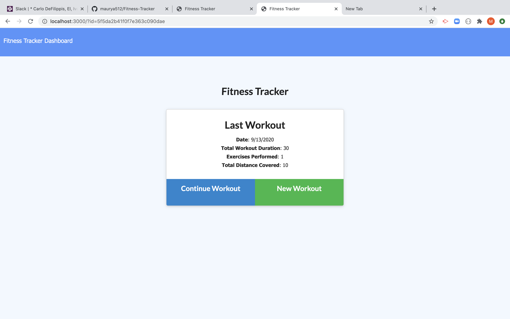
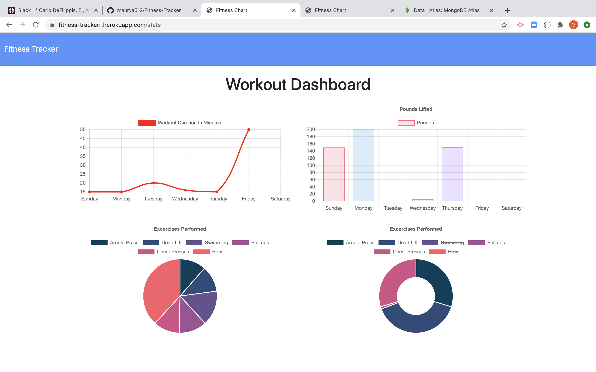
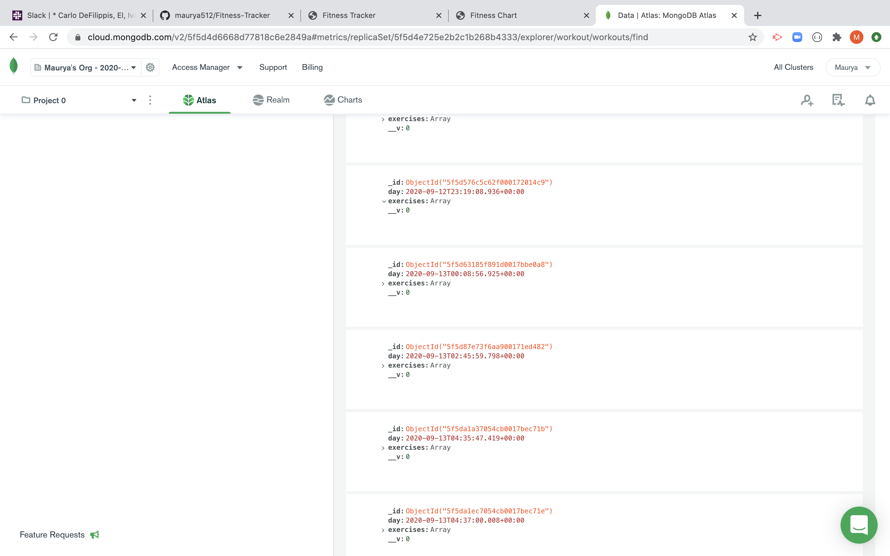

# Fitness-Tracker
  As a user, I want to be able to view create and track daily workouts. I want to be able to log multiple exercises in a workout on a given day. I should also be able to track the name, type, weight, sets, reps, and duration of exercise. If the exercise is a cardio exercise, I should be able to track my distance traveled.

# Table Contents
- [Description](#Description)
- [Installation Instructions](#Instructions)
- [Original Contributor](#Contributor)
- [Deployer](#Deployer)
- [Demo](#Demo)
- [Link to the App](#App)
- [Screenshots](#Screenshots)
- [Contributors](#Contributors)
- [Questions](#Questions)

## Description
  For this assignment we will create a Fitness-Tracker app that let's us track our daily workouts. All the functionality of this app can be attained by Mongo, Express and Node.js. 

## Instructions
  To start using the app first we need to install basic dependencies and seeds. 
  ```
  npm install
  npm run seed
  npm start
  ```
  Doing so will install all the dependencies needed in package.json file, insert the seeds and run your localhost server. 

  Once we are able to use the application locally we can now move on to the next step and that is deploying the app on heroku. 
  Within your application directory and inside of the terminal type the following commands. 
  ```
  heroku login
  heroku create
  ```
  These steps should log us into heroku and should've created an app for us. 
  
  Next step is to go this [link](https://www.mongodb.com/cloud/atlas/lp/try2?utm_source=google&utm_campaign=gs_americas_united_states_search_brand_atlas_desktop&utm_term=%2Bmongo%20%2Bdb%20%2Batlas&utm_medium=cpc_paid_search&utm_ad=b&utm_ad_campaign_id=1718986498&gclid=CjwKCAjw4_H6BRALEiwAvgfzqyKbbj1J-42iF-76-KUxw5aXX8TxWsIIQTSa_Z-A3PNd3Jvh5qxFBBoC4VoQAvD_BwE) and setup an account for mongo atlas. 
  Once done we need to create a cluster. Within that cluster we create a remote database where the connection to our heroku app will be made. Once the database is created we grab the connecting string and insert into "Reveal Config Vars" section of the heroku apps' settings.
  We need to ensure that we update the link with our password and database name. Once the connection is made we should be able to add our workouts into the remote database. 

## Contributor
  The source code for this project was provided to us by the Teachers and TA's. The logic behind the app however "models", "routes" and server deployment was handled by me. 

## Deployer
  This app is deployed by [maurya](https://github.com/).

## Demo
  The link to the demo can be found [here](https://drive.google.com/file/d/1KEKq1qtaCXcoZMfCJYfSa3DIpvo7RsDg/view).

## App
  The link to the app can be found [app](https://fitness-trackerr.herokuapp.com/?id=5f5da1ec7054cb0017bec71e).

## Screenshots
Workout Tracker home page serving on local host.



The dashboard showing all of the workouts in a pie and graphical chart on the heroku app.


The screenshot showing all workouts being added into the remote database. 


## Contributors
  Anyone with a github account can contribute to this project. 

## Questions
  In case of any questions regarding this project please contact me at my [github](https://github.com/) or at my [email](patelmaurya0512@gmail.com).
